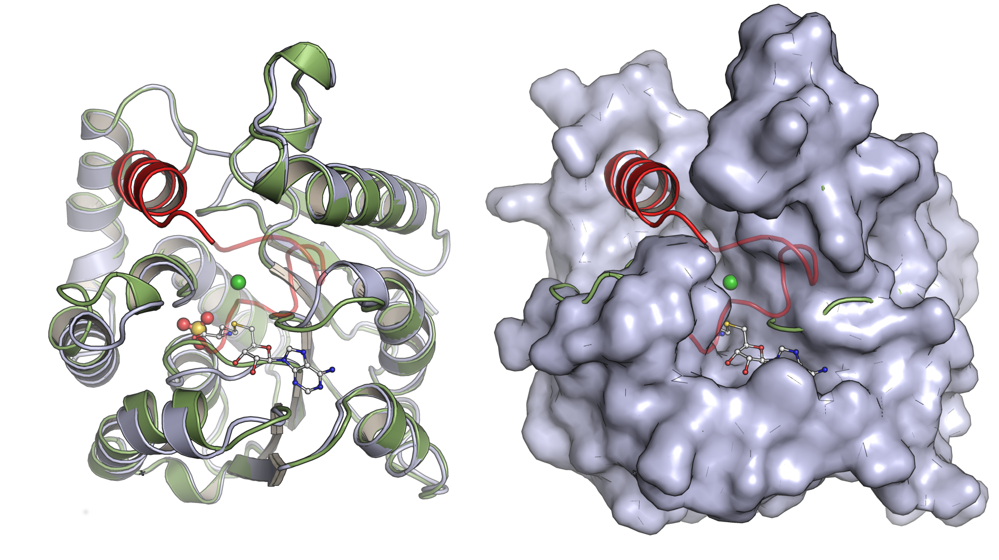

Biotransformations from and to methylated flavonoids
===

[![CC BY-NC-SA 4.0][cc-by-nc-sa-shield]][cc-by-nc-sa]

This is the git project that build my [dissertation thesis](https://digital.bibliothek.uni-halle.de/ulbhalhs/urn/urn:nbn:de:gbv:3:4-20753).
I thought it would be a good idea to share this to the world. For people to see how messy it can be. Not sure it compiles anymore...
I know I used to have a `Dockerfile` that could build this monster, but cannot find it anymore...guess it wasn't so important after I got it printed.

Anyway...enjoy :)

## License

This work is licensed under a
[Creative Commons Attribution-NonCommercial-ShareAlike 4.0 International License][cc-by-nc-sa].

[![CC BY-NC-SA 4.0][cc-by-nc-sa-image]][cc-by-nc-sa]

[cc-by-nc-sa]: http://creativecommons.org/licenses/by-nc-sa/4.0/
[cc-by-nc-sa-image]: https://licensebuttons.net/l/by-nc-sa/4.0/88x31.png
[cc-by-nc-sa-shield]: https://img.shields.io/badge/License-CC%20BY--NC--SA%204.0-lightgrey.svg
